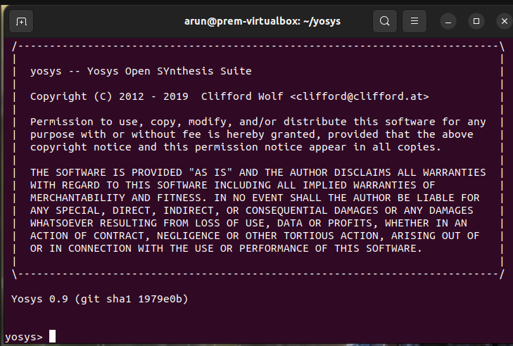
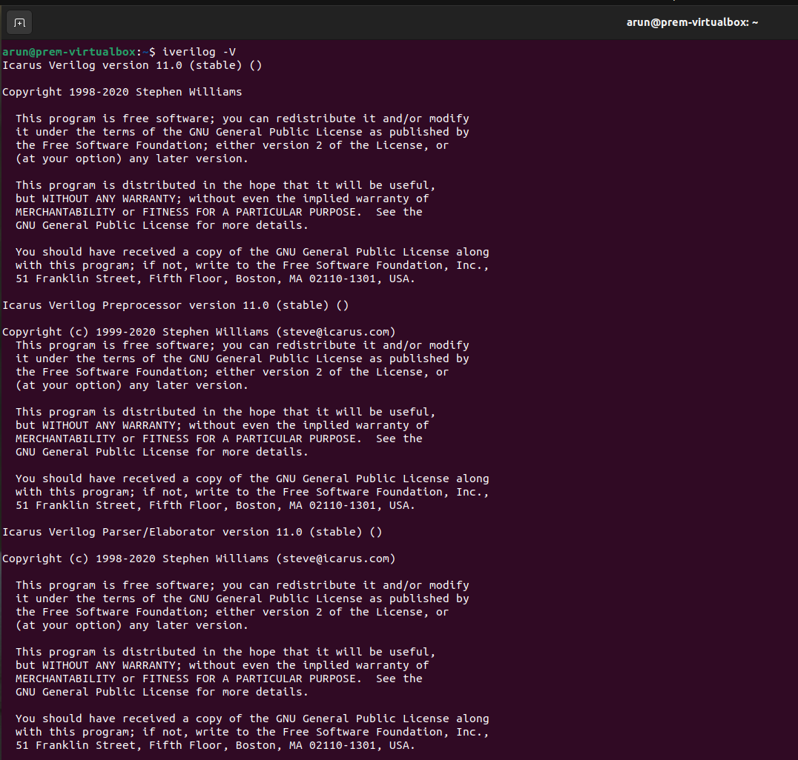
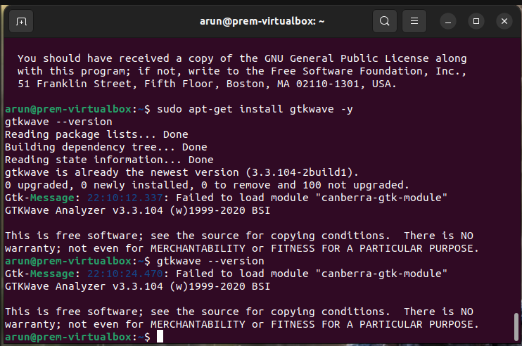
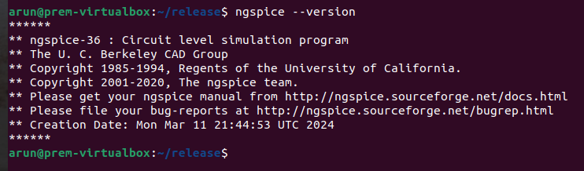
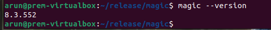

# RISC-V Reference SoC Tapeout – Week 0

This repository contains installation proofs of open-source VLSI tools.  
Each tool has its own subdirectory with screenshots of version checks.

## Tools Installed

- [Yosys](./Yosys)  
  

- [Iverilog](./Iverilog)  
  

- [GTKWave](./GTKWave)  
  

- [Ngspice](./Ngspice)  
  

- [Magic](./Magic)  
  
