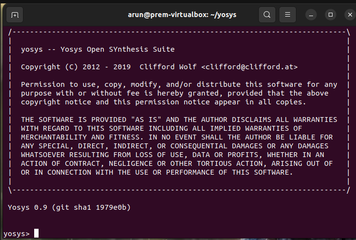
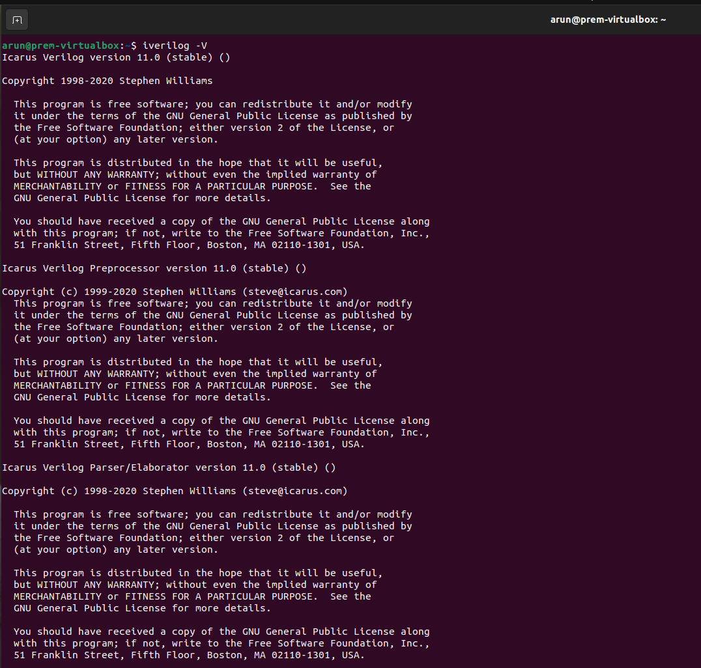
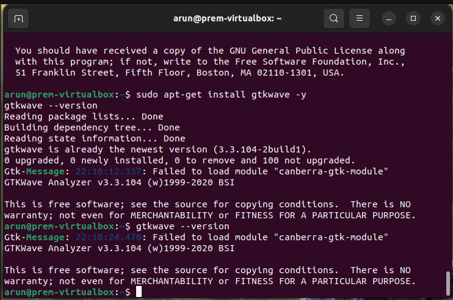
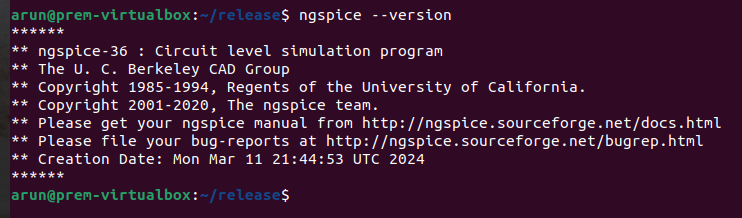
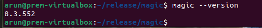
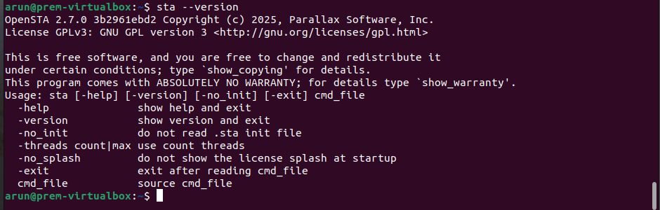
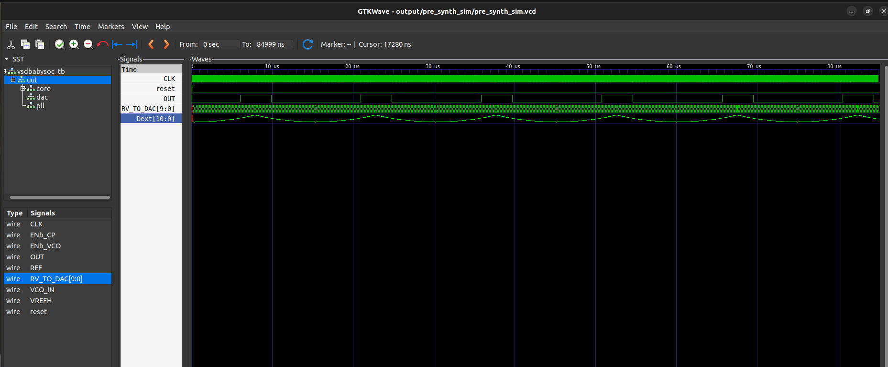
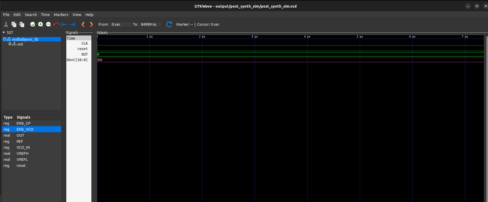

# RISC-V Reference SoC Tapeout

This repository documents my learning journey for the **RISC-V Reference SoC Tapeout** project.
Each week contains its own subfolder with proofs, logs, and screenshots.

---

## 🛠 Week-0 – Tool Installation Proofs

In this week, I installed and verified essential **open-source VLSI tools** required for the SoC design flow.

* Folder: [Week-0](./Week-0)
* Tools Installed:

  * [Yosys](./Week-0/Yosys)
    
  * [Iverilog](./Week-0/Iverilog)
    
  * [GTKWave](./Week-0/GTKWave)
    
  * [Ngspice](./Week-0/Ngspice)
    
  * [Magic](./Week-0/Magic)
    
  * [OpenSTA](./Week-0/OpenSTA)
    

**Summary:** Week-0 demonstrates the installation and version checks of tools forming the base environment for digital design and verification.

---

## 📚 Week-2 – SoC Fundamentals & BabySoC Modelling

This week covers **SoC Fundamentals** and **Functional Modelling of BabySoC**.
The work is divided into two parts:

### 📖 Part 1 – Theory (Conceptual Understanding)

* File: [Week-2_part1.md](./Week-2/Week-2_part1/Week-2_part1.md)
* Contents:

  * What is a System-on-Chip (SoC)?
  * Components of a typical SoC (CPU, memory, peripherals, interconnect).
  * Why BabySoC is a simplified model for learning.
  * Role of functional modelling before RTL/physical design.

This provides the theoretical foundation to understand SoC design before moving into hands-on modelling.

---

### 🧪 Part 2 – Labs (Functional Modelling)

* Folder: [Week-2_part2](./Week-2/Week-2_part2)
* Deliverables:

  1. **Simulation Logs** – [Week2_part2_sim.md](./Week-2/Week-2_part2/Simulation_logs/Week2_part2_sim.md)

     * Pre-synthesis simulation log
     * Post-synthesis simulation log
     * Commands + explanations

  2. **GTKWave Screenshots** – [GTKWave_screenshots](./Week-2/Week-2_part2/GTKWave_screenshots)

     * Pre-synthesis waveform
       
     * Post-synthesis waveform
       

---

### ✅ Week-2 Summary

* **Part 1 (Theory):** Built an understanding of SoC basics and BabySoC’s role in learning.
* **Part 2 (Labs):**

  * Successfully simulated BabySoC using **Icarus Verilog**.
  * Verified outputs in **GTKWave** for both pre- and post-synthesis stages.
  * Documented logs and screenshots for reproducibility.

This week bridges the gap between **conceptual SoC knowledge** and **hands-on functional modelling**.

